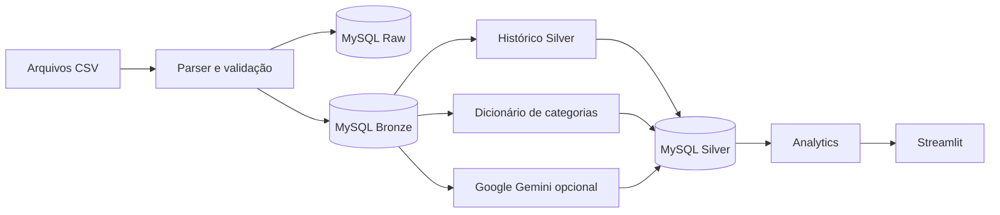

# Personal Expenses

Uma aplicação de análise financeira para transformar faturas de cartão de crédito em dados organizados, categorias revisáveis e painéis interativos.

O projeto combina uma interface Streamlit com um pipeline em camadas Raw, Bronze e Silver no MySQL. Arquivos CSV são preservados em formato bruto, padronizados para análise e enriquecidos por regras locais, histórico de classificações e Google Gemini.

## O que o projeto entrega

- Ingestão em lote de faturas CSV com suporte a cabeçalhos em português e inglês.
- Arquitetura medalhão em três bancos MySQL independentes.
- Deduplicação entre cargas e alinhamento automático de colunas.
- Categorização por histórico, dicionário local e fallback opcional para o Gemini.
- Dashboard com indicadores, tendências, categorias, recorrências e projeções de parcelas.
- Edição e manutenção das camadas por uma interface Streamlit.
- Testes unitários sem dependência de MySQL ou Gemini ativos.

## Arquitetura e fluxo do projeto



### Fluxo em cinco etapas

1. A aba de ingestão recebe uma ou mais faturas CSV.
2. O parser preserva as colunas originais na Raw e cria uma representação tipada na Bronze.
3. Comerciantes conhecidos são classificados pelo histórico da Silver ou pelo dicionário local.
4. Comerciantes ainda desconhecidos podem ser enviados ao Gemini em lotes e revisados antes da persistência.
5. A Silver alimenta filtros, métricas, gráficos, relatórios e projeções do Streamlit.

## Camadas de dados

| Camada | Responsabilidade | Exemplos de tratamento |
| --- | --- | --- |
| Raw | Preservar a entrada recebida | Strings originais, cabeçalhos e arquivo de origem |
| Bronze | Padronizar e tipar | Datas, valores monetários, parcelas e identificadores |
| Silver | Enriquecer para consumo | Categorias, motivação, origem da classificação e campos analíticos |

As camadas usam o mesmo nome de tabela, configurado por `MYSQL_TABLE`, em bancos separados. A aplicação cria tabelas ausentes e adiciona novas colunas esperadas sem exigir uma migração manual.

## Produto analítico

A interface possui sete jornadas que compartilham os filtros globais de período, categoria, portador e tipo de transação.

| Página | Pergunta respondida |
| --- | --- |
| General Dashboard | Quanto foi gasto e quais categorias ou comerciantes concentram as despesas? |
| Trends & Insights | Como os gastos evoluem e onde existem anomalias ou mudanças de comportamento? |
| Category Analysis | Como cada categoria se distribui por mês, comerciante e dia da semana? |
| Reports & Projections | Quais parcelas permanecem comprometidas nos próximos meses? |
| Ingest Invoices | Quais arquivos e registros serão carregados em Raw e Bronze? |
| AI Categorization | Quais comerciantes foram reconhecidos e quais precisam de classificação? |
| Lakehouse Management | Como inspecionar, editar e deduplicar as três camadas? |

### Regras analíticas importantes

- Pagamentos de fatura são separados de compras e não entram no gasto líquido.
- Reembolsos negativos de comerciantes reduzem o total líquido.
- Parcelas futuras são projetadas a partir da parcela atual e do total contratado.
- Valores desconhecidos de categoria são normalizados para `not_found`.
- Aliases de comerciantes são aplicados na leitura da Silver, sem alterar os dados persistidos.
- O limite de referência dos relatórios é configurável e não representa aconselhamento financeiro.

## Tecnologias

| Responsabilidade | Tecnologias |
| --- | --- |
| Interface e visualização | Streamlit, Plotly |
| Processamento | Python, Pandas, NumPy |
| Persistência | MySQL, SQLAlchemy, PyMySQL |
| Categorização assistida | Google Gemini |
| Ambiente | uv, Docker, Docker Compose |
| Qualidade | Pytest, Ruff, GitHub Actions |

## Execução local

### Pré-requisitos

- Python 3.13 ou superior;
- [uv](https://docs.astral.sh/uv/);
- servidor MySQL acessível;
- chave do Google Gemini apenas para a categorização por IA;
- Docker com Docker Compose, caso prefira executar em container.

### Configuração

```bash
cp .env.example .env
uv sync --all-groups
```

Preencha o `.env` com as credenciais do seu ambiente:

```env
MYSQL_HOST="127.0.0.1"
MYSQL_PORT="3306"
MYSQL_USER="root"
MYSQL_PASSWORD="your_database_password_here"
MYSQL_TABLE="personal_expenses"

MYSQL_DB_RAW="raw"
MYSQL_DB_BRONZE="bronze"
MYSQL_DB_SILVER="silver"

GEMINI_API_KEY="your_gemini_api_key_here"
GEMINI_MODEL="gemini-3.6-flash"

REFERENCE_BUDGET_LIMIT="10000"
CATEGORY_LOCAL_PATH="data/categories.local.json"
STREAMLIT_PORT="8503"
```

### Iniciar a aplicação

```bash
uv run streamlit run main.py
```

O Streamlit estará disponível em `http://localhost:8503`.

### Executar com Docker

```bash
docker compose up --build -d
docker compose logs -f streamlit
```

O Compose inicia somente a aplicação. O MySQL deve estar acessível a partir da rede do container.

## Categorias e aprendizado local

`data/categories.default.json` contém apenas termos genéricos e seguros para distribuição pública. Classificações aprendidas durante o uso são mescladas ao seed e gravadas em `data/categories.local.json`.

O arquivo local é ignorado pelo Git e pelo build Docker, mas permanece no volume `data/` quando a aplicação roda pelo Compose. Assim, o aprendizado pode persistir na máquina sem transformar nomes de comerciantes em conteúdo versionado.

## Privacidade e segurança

- Não adicione faturas, extratos, exports, dumps de banco ou arquivos `.env` ao repositório.
- Os padrões de exclusão cobrem CSV, TSV, planilhas, bancos locais, dumps SQL e o dicionário aprendido.
- Dados financeiros são persistidos no MySQL configurado pelo operador; o repositório não inclui dados de demonstração derivados de pessoas reais.
- Ao habilitar a categorização por IA, identificadores de comerciantes desconhecidos são enviados à API do Google Gemini. Revise os requisitos de privacidade aplicáveis antes de usar essa função.
- O controle “Hide amounts” reduz a exposição casual na tela, mas não substitui controles de acesso ao banco ou à aplicação.

## Qualidade e testes

```bash
uv run pytest
uv run ruff check .
uv run ruff format --check .
```

A suíte cobre parsing de CSV, transformação medalhão, deduplicação, categorização, filtros, métricas, gráficos e importação da interface. As integrações externas são simuladas nos testes.

## Estrutura do repositório

```text
personal-expenses/
├── data/                         # seed público de categorias; dados locais são ignorados
├── src/expenses/
│   ├── ui/                       # componentes, gráficos e abas Streamlit
│   ├── ai_categorizer.py         # matching local e integração Gemini
│   ├── analytics.py              # métricas, tendências e projeções
│   ├── config.py                 # configuração e metadados compartilhados
│   ├── database.py               # bancos Raw, Bronze e Silver
│   └── parser.py                 # leitura e padronização dos CSVs
├── template/                     # prompt de categorização
├── tests/                        # suíte unitária e smoke tests
├── main.py                       # entrada da aplicação
├── Dockerfile
├── docker-compose.yml
└── pyproject.toml
```

## Limitações e próximos passos

- O parser depende da presença de colunas semanticamente equivalentes a data, comerciante, portador, valor e parcela.
- MySQL e Gemini não são provisionados pelo Docker Compose.
- A deduplicação é implementada na aplicação e não por restrições únicas no banco.
- A classificação por IA pode errar e deve ser revisada antes de orientar decisões.
- Autenticação, autorização multiusuário e implantação gerenciada não fazem parte desta versão.

## Licença

Distribuído sob a licença MIT. Consulte `LICENSE`.
