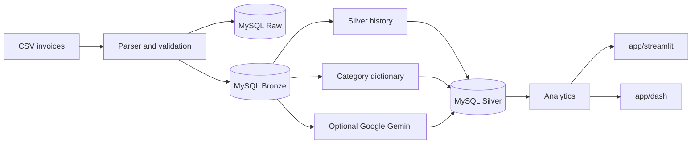

# Personal Expenses

A personal finance analytics project that turns credit card invoices into organized data, reviewable categories and interactive dashboards.

It ships two frontends — a **Streamlit** app (analysis plus data operations) and a read-only **Dash** dashboard — on top of a Raw → Bronze → Silver pipeline in MySQL. CSV files are preserved as received, standardized for analysis and enriched by local rules, classification history and Google Gemini.

## What it provides

- Batch ingestion of CSV invoices, with Portuguese and English header detection.
- Medallion architecture across three independent MySQL databases.
- Deduplication across loads and automatic column alignment.
- Categorization by history, a local dictionary and an optional Gemini fallback.
- Dashboards with KPIs, trends, habits, categories, recurring charges and installment projections.
- Editing and maintenance of every layer from the Streamlit app.
- Each app with its own dependencies and Docker image (uv workspace).
- Unit tests for every function, with no live MySQL or Gemini required.

## Architecture and flow


```mermaid
flowchart LR
    csv[CSV invoices] --> parser[Parser and validation]
    parser --> raw[(MySQL Raw)]
    parser --> bronze[(MySQL Bronze)]

    bronze --> history[Silver history]
    bronze --> dictionary[Category dictionary]
    bronze --> gemini[Optional Google Gemini]

    history --> silver[(MySQL Silver)]
    dictionary --> silver
    gemini --> silver

    silver --> analytics[Analytics]
    analytics --> streamlit[app/streamlit]
    analytics --> dash[app/dash]
```

### Five steps

1. The Streamlit **Data → Ingest** tab receives one or more CSV invoices.
2. The parser keeps the original columns in Raw and writes a typed representation to Bronze.
3. Known merchants are classified from the Silver history or the local dictionary.
4. Still-unknown merchants can be sent to Gemini in batches and reviewed before they are stored.
5. Silver feeds the filters, metrics, charts, reports and projections of both apps.

## Data layers

| Layer | Responsibility | Examples |
| --- | --- | --- |
| Raw | Preserve the input as received | Original strings, headers and source file |
| Bronze | Standardize and type | Dates, currency values, installments and identifiers |
| Silver | Enrich for consumption | Category, motivation, classification source and analytic fields |

All layers use the same table name (`MYSQL_TABLE`) in separate databases. Missing tables are created and new expected columns are added automatically, with no manual migrations.

## Analytics

### Streamlit (`app/streamlit`)

Five analysis tabs, each answering one question, plus a **Data** tab for data operations. All tabs share the period, cardholder and category filters (transaction type, payment method and merchant search live under "More filters"; hiding amounts and reloading data live under "Display").

| Tab | Question |
| --- | --- |
| Overview | How much was spent, where, what is already committed to the next invoice and what needs attention? |
| Trends | Is spending going up or down, against the previous period and last year? |
| Watchlist | Which recurring charges, unusual purchases and uncategorized spending deserve a look? |
| Categories | What is inside a category: history, merchants and day of week? |
| Reports | How much is committed in installments, and where is the full data to export? |
| Data → Ingest | Which files and rows will be loaded into Raw and Bronze? |
| Data → Categorize | Which merchants were recognized and which still need a category? |
| Data → Manage | How to inspect, edit and deduplicate the three layers? |

### Dash (`app/dash`)

A read-only dashboard with a Portuguese UI (values formatted as R$ 1.234,56), dark theme and per-category colors, using the same period, cardholder and category filters:

| Tab | What it shows |
| --- | --- |
| Visão geral (Overview) | Spend in the period, monthly average, latest invoice, next-month installments, monthly evolution, categories, merchants and largest purchases |
| Tendências (Trends) | Current vs previous period, same months last year, category × month heatmap and category momentum |
| Hábitos (Habits) | Single payment vs installments, ticket-size bands, weekday, spend per cardholder and merchant concentration |
| Atenção (Watchlist) | Fixed cost, recurring charges, unusual purchases, uncategorized spend, new merchants and frequency changes |
| Categorias (Categories) | One category in detail: total, share, history, merchants and largest purchases |
| Relatórios (Reports) | Installments vs the limit, upcoming installments, invoice totals and CSV download |

Ingestion, categorization and maintenance stay in the Streamlit app.

### Analytics rules

- Invoice payments are kept apart from purchases and never count as spending.
- Negative merchant refunds reduce the net total.
- Future installments are projected from the current installment and the contracted total.
- Unknown category values are normalized to `not_found`.
- Merchant aliases are applied when reading Silver, without changing stored data.
- The reports' reference limit is configurable and is not financial advice.

## Technology

| Area | Tools |
| --- | --- |
| Interface and charts | Streamlit, Dash, Plotly |
| Processing | Python, Pandas, NumPy |
| Storage | MySQL, SQLAlchemy, PyMySQL |
| Assisted categorization | Google Gemini |
| Environment | uv (workspace), Docker, Docker Compose |
| Quality | Pytest, pytest-cov, Ruff, GitHub Actions |

## Running locally

### Requirements

- Python 3.13 or newer;
- [uv](https://docs.astral.sh/uv/);
- a reachable MySQL server;
- a Google Gemini key, only for AI categorization;
- Docker with Docker Compose, if you prefer containers.

### Setup

```bash
cp .env.example .env
uv sync --all-packages --all-groups   # backend + both apps + dev tools
```

Fill `.env` with your environment's settings:

```env
MYSQL_HOST="127.0.0.1"
MYSQL_PORT="3306"
MYSQL_USER="root"
MYSQL_PASSWORD="your_database_password_here"
MYSQL_TABLE="personal_expenses"

MYSQL_DB_RAW="raw"
MYSQL_DB_BRONZE="bronze"
MYSQL_DB_SILVER="silver"

GEMINI_API_KEY="your_gemini_api_key_here"
GEMINI_MODEL="gemini-3.6-flash"

REFERENCE_BUDGET_LIMIT="10000"
CATEGORY_LOCAL_PATH="docs/data/categories.local.json"
STREAMLIT_PORT="8503"
DASH_PORT="8050"
```

### Start the apps

```bash
uv run --directory app/streamlit streamlit run main.py   # full app on http://localhost:8503
uv run --directory app/dash python main.py               # read-only dashboard on http://localhost:8050
```

Each app runs from its own folder (Streamlit reads `app/streamlit/.streamlit/config.toml`); project files under `docs/` are resolved from the repository root, so the working directory does not matter for them.

### Docker

```bash
docker compose up --build -d
docker compose logs -f streamlit dash
```

The root `docker-compose.yml` starts two services, each built from its app's own Dockerfile: `streamlit` (`app/streamlit/Dockerfile`, `:8503`) and `dash` (`app/dash/Dockerfile`, `:8050`). Each image installs only its app's dependencies (the Dash image has no Streamlit and vice versa). MySQL must be reachable from the container network.

## Categories and local learning

`docs/data/categories.default.json` holds only generic terms that are safe to publish. Classifications learned while using the app are merged into the seed and written to `docs/data/categories.local.json`.

The local file is ignored by Git and by the Docker build, but it lives in the `docs/data/` volume mounted by Compose, so the learning persists on your machine without turning merchant names into versioned content. The Gemini prompt template is `docs/template/prompt.md`.

## Privacy and security

- Never commit invoices, statements, exports, database dumps or `.env` files.
- The ignore rules cover CSV, TSV, spreadsheets, local databases, SQL dumps and the learned dictionary.
- Financial data is stored in the MySQL server you configure; the repository ships no demo data derived from real people.
- With AI categorization enabled, unknown merchant identifiers are sent to the Google Gemini API. Review the applicable privacy requirements before using it.
- The "Hide amounts" switch reduces casual on-screen exposure but does not replace access control to the database or the apps.

## Quality and tests

```bash
uv run pytest                           # backend (tests/) + app/streamlit/tests + app/dash/tests
uv run pytest app/dash/tests            # a single app
uv run pytest --cov=expenses --cov=expenses_streamlit --cov=expenses_dash
uv run ruff check .
uv run ruff format --check .
```

Each package has its own suite — `tests/` for the backend, `app/streamlit/tests/` and `app/dash/tests/` for the apps — with shared fixtures in the root `conftest.py`. `tests/test_every_function_is_tested.py` fails if any function in the project is not named in a test, and `tests/test_architecture.py` checks that the backend imports neither Streamlit nor Dash and that neither app imports the other. The database (SQLite in the write-path tests), Gemini and Streamlit (`AppTest`) are simulated; no test reaches MySQL or the API.

## Repository layout

```text
personal-expenses/
├── pyproject.toml                # uv workspace + backend package (expenses) + dev tools
├── uv.lock
├── conftest.py                   # shared test fixtures
├── src/expenses/                 # backend shared by both apps
│   ├── ai_categorizer.py         # local matching and Gemini integration
│   ├── analytics.py              # metrics, trends and projections
│   ├── config.py                 # settings, paths and category metadata
│   ├── database.py               # Raw, Bronze and Silver databases
│   ├── filters.py                # global filters
│   ├── gemini.py                 # Gemini client with retry and model fallback
│   ├── parser.py                 # CSV reading and standardization
│   └── runtime.py                # caching and notifications without Streamlit
├── tests/                        # backend and architecture tests
├── app/
│   ├── streamlit/
│   │   ├── pyproject.toml        # app dependencies (streamlit, plotly, expenses)
│   │   ├── Dockerfile
│   │   ├── main.py               # entrypoint (streamlit run main.py)
│   │   ├── .streamlit/           # theme and settings
│   │   ├── src/expenses_streamlit/   # tabs, charts, styles, sidebar
│   │   └── tests/
│   └── dash/
│       ├── pyproject.toml        # app dependencies (dash, plotly, expenses)
│       ├── Dockerfile
│       ├── main.py               # entrypoint (python main.py)
│       ├── src/expenses_dash/    # data, analyses, figures, layout, callbacks, assets/
│       └── tests/
├── docs/
│   ├── data/                     # public category seed; the learned dictionary is git-ignored
│   └── template/                 # Gemini categorization prompt
├── docker-compose.yml            # runs both apps
└── .github/workflows/ci.yml      # lint, format and tests with coverage
```

## Limitations and next steps

- The parser needs columns that semantically match date, merchant, cardholder, amount and installment.
- MySQL and Gemini are not provisioned by Docker Compose.
- Deduplication is done in the application, not by unique constraints in the database.
- AI classification can be wrong and should be reviewed before driving decisions.
- Authentication, multi-user authorization and managed deployment are out of scope for this version.

## License

Distributed under the MIT license. See `LICENSE`.
