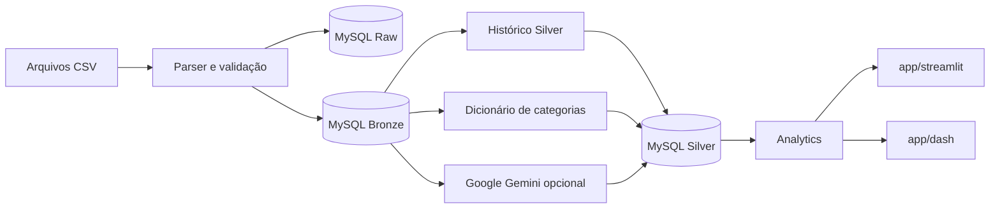

# Personal Expenses

Uma aplicação de análise financeira para transformar faturas de cartão de crédito em dados organizados, categorias revisáveis e painéis interativos.

O projeto tem duas interfaces, uma em Streamlit (análise e operação dos dados) e outra em Dash (painel somente leitura), sobre um pipeline em camadas Raw, Bronze e Silver no MySQL. Arquivos CSV são preservados em formato bruto, padronizados para análise e enriquecidos por regras locais, histórico de classificações e Google Gemini.

## O que o projeto entrega

- Ingestão em lote de faturas CSV com suporte a cabeçalhos em português e inglês.
- Arquitetura medalhão em três bancos MySQL independentes.
- Deduplicação entre cargas e alinhamento automático de colunas.
- Categorização por histórico, dicionário local e fallback opcional para o Gemini.
- Dashboard com indicadores, tendências, hábitos, categorias, recorrências e projeções de parcelas.
- Edição e manutenção das camadas pela interface Streamlit.
- Cada aplicação com suas próprias dependências e imagem Docker (workspace uv).
- Testes unitários para cada função, sem dependência de MySQL ou Gemini ativos.

## Arquitetura e fluxo do projeto


```mermaid
flowchart LR
    csv[Arquivos CSV] --> parser[Parser e validação]
    parser --> raw[(MySQL Raw)]
    parser --> bronze[(MySQL Bronze)]

    bronze --> history[Histórico Silver]
    bronze --> dictionary[Dicionário de categorias]
    bronze --> gemini[Google Gemini opcional]

    history --> silver[(MySQL Silver)]
    dictionary --> silver
    gemini --> silver

    silver --> analytics[Analytics]
    analytics --> streamlit[app/streamlit]
    analytics --> dash[app/dash]
```

### Fluxo em cinco etapas

1. A aba **Data → Ingest** do Streamlit recebe uma ou mais faturas CSV.
2. O parser preserva as colunas originais na Raw e cria uma representação tipada na Bronze.
3. Comerciantes conhecidos são classificados pelo histórico da Silver ou pelo dicionário local.
4. Comerciantes ainda desconhecidos podem ser enviados ao Gemini em lotes e revisados antes da persistência.
5. A Silver alimenta filtros, métricas, gráficos, relatórios e projeções das duas aplicações.

## Camadas de dados

| Camada | Responsabilidade | Exemplos de tratamento |
| --- | --- | --- |
| Raw | Preservar a entrada recebida | Strings originais, cabeçalhos e arquivo de origem |
| Bronze | Padronizar e tipar | Datas, valores monetários, parcelas e identificadores |
| Silver | Enriquecer para consumo | Categorias, motivação, origem da classificação e campos analíticos |

As camadas usam o mesmo nome de tabela, configurado por `MYSQL_TABLE`, em bancos separados. A aplicação cria tabelas ausentes e adiciona novas colunas esperadas sem exigir uma migração manual.

## Produto analítico

### Streamlit (`app/streamlit`)

A interface tem cinco abas de análise, cada uma respondendo a uma pergunta, e uma aba **Data** com as operações de dados. Todas compartilham os filtros de período, portador e categoria (tipo de transação, forma de pagamento e busca ficam em "More filters"; ocultar valores e recarregar dados ficam em "Display").

| Aba | Pergunta respondida |
| --- | --- |
| Overview | Quanto foi gasto, onde, quanto já está comprometido na próxima fatura e o que precisa de atenção? |
| Trends | Os gastos estão subindo ou caindo, contra o período anterior e o ano passado? |
| Watchlist | Quais cobranças recorrentes, compras fora do padrão e gastos sem categoria merecem revisão? |
| Categories | O que compõe uma categoria: histórico, comerciantes e dia da semana? |
| Reports | Quanto já está comprometido em parcelas e onde estão os dados completos para exportar? |
| Data → Ingest | Quais arquivos e registros serão carregados em Raw e Bronze? |
| Data → Categorize | Quais comerciantes foram reconhecidos e quais precisam de classificação? |
| Data → Manage | Como inspecionar, editar e deduplicar as três camadas? |

### Dash (`app/dash`)

Painel somente leitura em português (valores como R$ 1.234,56), modo escuro e cores por categoria, com os mesmos filtros de período, titular e categoria:

| Aba | O que mostra |
| --- | --- |
| Visão geral | Gasto no período, média mensal, última fatura, parcelas da próxima fatura, evolução mensal, categorias, estabelecimentos e maiores compras |
| Tendências | Período atual vs anterior, mesmos meses do ano anterior, mapa de calor categoria × mês e momento das categorias |
| Hábitos | À vista vs parcelado, faixas de valor, dia da semana, gasto por titular e concentração nos maiores estabelecimentos |
| Atenção | Custo fixo, recorrências, compras atípicas, gastos sem categoria, estabelecimentos novos e mudança de frequência |
| Categorias | Detalhe de uma categoria: total, participação, histórico, estabelecimentos e maiores compras |
| Relatórios | Parcelas contra o limite, próximas parcelas, totais por fatura e download em CSV |

Importação, categorização e manutenção continuam no Streamlit.

### Regras analíticas importantes

- Pagamentos de fatura são separados de compras e não entram no gasto líquido.
- Reembolsos negativos de comerciantes reduzem o total líquido.
- Parcelas futuras são projetadas a partir da parcela atual e do total contratado.
- Valores desconhecidos de categoria são normalizados para `not_found`.
- Aliases de comerciantes são aplicados na leitura da Silver, sem alterar os dados persistidos.
- O limite de referência dos relatórios é configurável e não representa aconselhamento financeiro.

## Tecnologias

| Responsabilidade | Tecnologias |
| --- | --- |
| Interface e visualização | Streamlit, Dash, Plotly |
| Processamento | Python, Pandas, NumPy |
| Persistência | MySQL, SQLAlchemy, PyMySQL |
| Categorização assistida | Google Gemini |
| Ambiente | uv, Docker, Docker Compose |
| Qualidade | Pytest, Ruff, GitHub Actions |

## Execução local

### Pré-requisitos

- Python 3.13 ou superior;
- [uv](https://docs.astral.sh/uv/);
- servidor MySQL acessível;
- chave do Google Gemini apenas para a categorização por IA;
- Docker com Docker Compose, caso prefira executar em container.

### Configuração

```bash
cp .env.example .env
uv sync --all-packages --all-groups   # backend + as duas aplicações + ferramentas de dev
```

Preencha o `.env` com as credenciais do seu ambiente:

```env
MYSQL_HOST="127.0.0.1"
MYSQL_PORT="3306"
MYSQL_USER="root"
MYSQL_PASSWORD="your_database_password_here"
MYSQL_TABLE="personal_expenses"

MYSQL_DB_RAW="raw"
MYSQL_DB_BRONZE="bronze"
MYSQL_DB_SILVER="silver"

GEMINI_API_KEY="your_gemini_api_key_here"
GEMINI_MODEL="gemini-3.6-flash"

REFERENCE_BUDGET_LIMIT="10000"
CATEGORY_LOCAL_PATH="data/categories.local.json"
STREAMLIT_PORT="8503"
DASH_PORT="8050"
```

### Iniciar as aplicações

```bash
uv run --directory app/streamlit streamlit run main.py   # app completo em http://localhost:8503
uv run --directory app/dash python main.py               # dashboard Dash (somente leitura) em http://localhost:8050
```


### Executar com Docker

```bash
docker compose up --build -d
docker compose logs -f streamlit dash
```

O `docker-compose.yml` da raiz inicia dois serviços, cada um construído a partir do Dockerfile da própria aplicação: `streamlit` (`app/streamlit/Dockerfile`, `:8503`) e `dash` (`app/dash/Dockerfile`, `:8050`). Cada imagem instala só as dependências da sua aplicação (a do Dash não contém Streamlit e vice-versa). O MySQL deve estar acessível a partir da rede do container.

## Categorias e aprendizado local

`data/categories.default.json` contém apenas termos genéricos e seguros para distribuição pública. Classificações aprendidas durante o uso são mescladas ao seed e gravadas em `data/categories.local.json`.

O arquivo local é ignorado pelo Git e pelo build Docker, mas permanece no volume `data/` quando a aplicação roda pelo Compose. Assim, o aprendizado pode persistir na máquina sem transformar nomes de comerciantes em conteúdo versionado.

## Privacidade e segurança

- Não adicione faturas, extratos, exports, dumps de banco ou arquivos `.env` ao repositório.
- Os padrões de exclusão cobrem CSV, TSV, planilhas, bancos locais, dumps SQL e o dicionário aprendido.
- Dados financeiros são persistidos no MySQL configurado pelo operador; o repositório não inclui dados de demonstração derivados de pessoas reais.
- Ao habilitar a categorização por IA, identificadores de comerciantes desconhecidos são enviados à API do Google Gemini. Revise os requisitos de privacidade aplicáveis antes de usar essa função.
- O controle “Hide amounts” reduz a exposição casual na tela, mas não substitui controles de acesso ao banco ou à aplicação.

## Qualidade e testes

```bash
uv run pytest                           # backend (tests/) + app/streamlit/tests + app/dash/tests
uv run pytest app/dash/tests            # só uma aplicação
uv run pytest --cov=expenses --cov=expenses_streamlit --cov=expenses_dash
uv run ruff check .
uv run ruff format --check .
```

Cada pacote tem a sua suíte: `tests/` para o backend, `app/streamlit/tests/` e `app/dash/tests/` para as aplicações, com fixtures compartilhadas no `conftest.py` da raiz. O teste `tests/test_every_function_is_tested.py` falha se alguma função do projeto não aparecer em nenhum teste, e `tests/test_architecture.py` garante que o backend não importa Streamlit nem Dash e que uma aplicação não importa a outra. Banco (SQLite nos testes de escrita), Gemini e Streamlit (`AppTest`) são simulados; nenhum teste acessa MySQL ou a API.

## Estrutura do repositório

```text
personal-expenses/
├── pyproject.toml                # workspace uv + pacote do backend (expenses) + ferramentas de dev
├── uv.lock
├── conftest.py                   # fixtures de teste compartilhadas
├── src/expenses/                 # backend compartilhado pelas duas aplicações
│   ├── ai_categorizer.py         # matching local e integração Gemini
│   ├── analytics.py              # métricas, tendências e projeções
│   ├── config.py                 # configuração, caminhos e metadados de categorias
│   ├── database.py               # bancos Raw, Bronze e Silver
│   ├── filters.py                # filtros globais
│   ├── gemini.py                 # cliente Gemini com retry e fallback de modelos
│   ├── parser.py                 # leitura e padronização dos CSVs
│   └── runtime.py                # cache e avisos sem depender de Streamlit
├── tests/                        # testes do backend e da arquitetura
├── app/
│   ├── streamlit/
│   │   ├── pyproject.toml        # dependências da aplicação (streamlit, plotly, expenses)
│   │   ├── Dockerfile
│   │   ├── main.py               # entrada (streamlit run main.py)
│   │   ├── .streamlit/           # tema e configuração
│   │   ├── src/expenses_streamlit/   # abas, gráficos, estilos, barra lateral
│   │   └── tests/
│   └── dash/
│       ├── pyproject.toml        # dependências da aplicação (dash, plotly, expenses)
│       ├── Dockerfile
│       ├── main.py               # entrada (python main.py)
│       ├── src/expenses_dash/    # dados, análises, figuras, layout, callbacks, assets/
│       └── tests/
├── data/                         # seed público de categorias; dados locais são ignorados
├── template/                     # prompt de categorização
├── docker-compose.yml            # sobe as duas aplicações
└── .github/workflows/ci.yml      # lint, formatação e testes com cobertura
```

## Limitações e próximos passos

- O parser depende da presença de colunas semanticamente equivalentes a data, comerciante, portador, valor e parcela.
- MySQL e Gemini não são provisionados pelo Docker Compose.
- A deduplicação é implementada na aplicação e não por restrições únicas no banco.
- A classificação por IA pode errar e deve ser revisada antes de orientar decisões.
- Autenticação, autorização multiusuário e implantação gerenciada não fazem parte desta versão.

## Licença

Distribuído sob a licença MIT. Consulte `LICENSE`.
